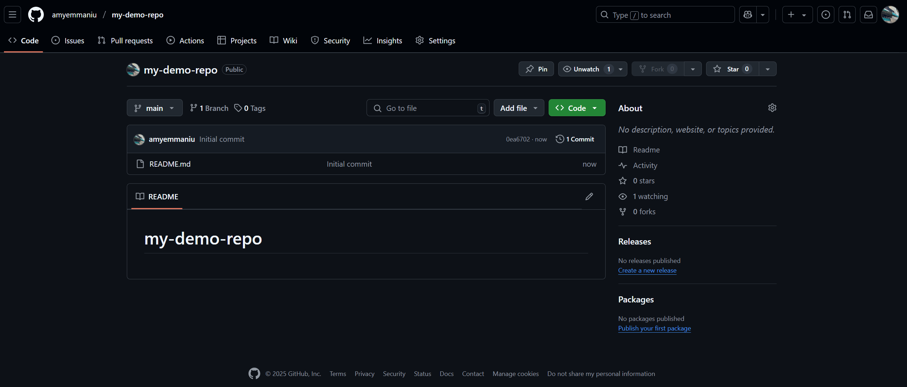
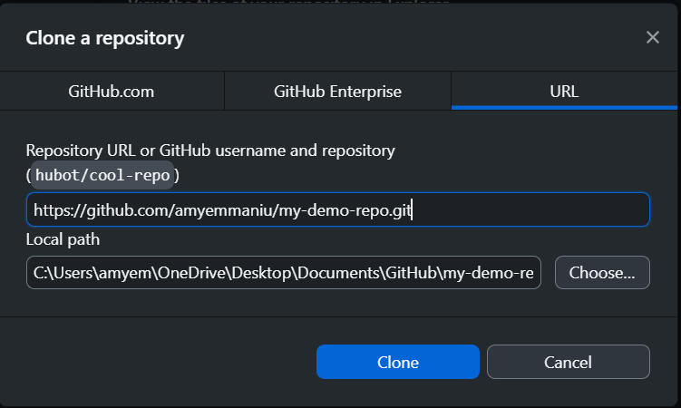

# Getting Started with GitHub

GitHub is a useful tool for collaborating on code and documentation. It streamlines version control and keeps files accessible for your whole team.

Using [GitHub Desktop](https://desktop.github.com/download/) is the most beginner-friendly way to contribute to a project on GitHub. Once you download the application, you'll be able to view repositories you're working with and track changes to your files.

## Cloning a repository

First, navigate to the repository of the [GitHub](https://github.com/) project to which you would like to contribute.

Click on the **Code** drop-down and copy the HTTPS web URL by clicking on the **Copy url to clipboard** button on to the right of the URL.

Open the GitHub Desktop application and click **Current repository** > **Add** > **Clone repository**.

In the **Clone a repository** tab, click on the **URL** tab and paste in the repository's URL. Then, select the local path (the place where the repository will be stored on your machine) and click **Clone**.

Now, you have a copy of the project on your local machine and can make contributions!

## Contributing to a project

After you've made changes to the project, open GitHub Desktop and navigate to the project's repository. You should see the changes you made on the right-hand side of the application window, and the files you changed on the left.

Write a summary of your changes and an optional description. Use the checkboxes on the left to choose which files to commit. Then, click **Commit *X* files to main**.

Note how the button at the top called **Fetch origin** is labeled **Push origin** once you commit. Press the button to send the changes from your computer to the GitHub server.

## Creating a pull request

Navigate to the repository on GitHub on your browser and click on the **Pull requests** tab. Click on **New pull request**.

Use the dropdowns to compare the GitHub repository on your browser with the one on your computer. You should see the summary and description (if you entered one) from when you committed your changes to the repository with GitHub Desktop. Click on **Create pull request** to submit your changes for review by the owner of the repository.

Each time a contributor makes a pull request, you'll need to ensure the changes they made are reflected on your computer. To do so, open GitHub Desktop and navigate to the repository you wish to update. Click on **Pull origin**, either from the top of the screen or from the the pop-up.

Now the files on your computer are up-to-date and you can continue working on them.

## Conclusion

That's all you need to know to contribute to a project on GitHub.
